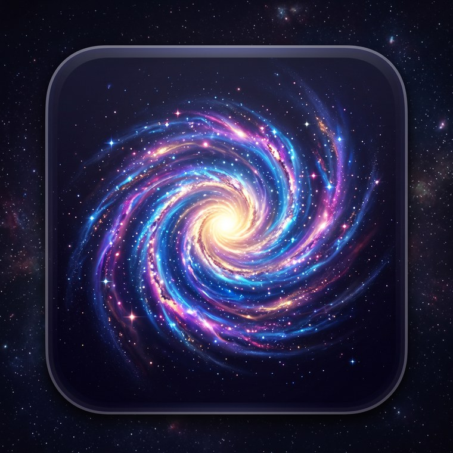
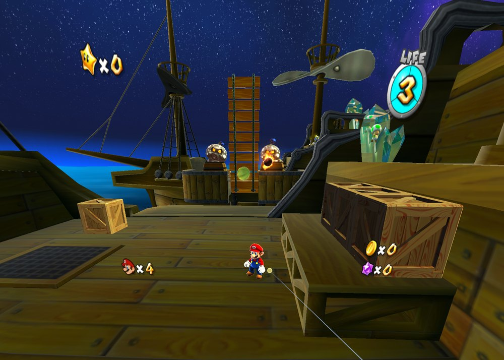
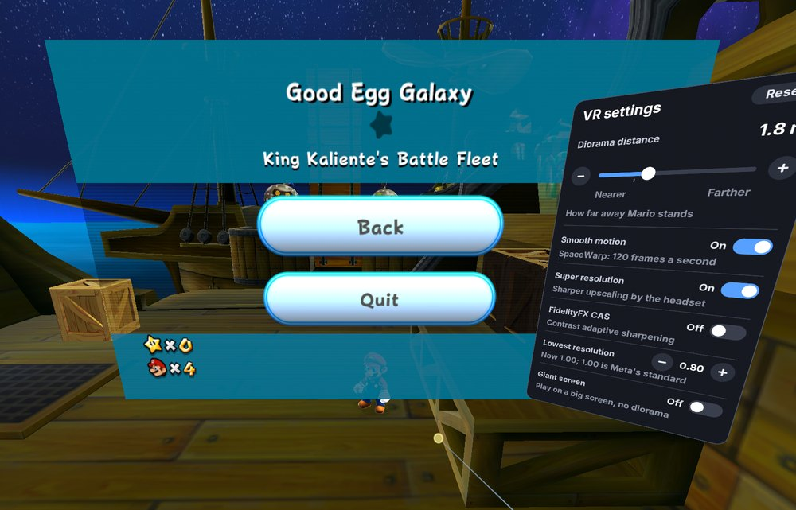

> **Disclaimer: this project is 100% made by AI.** All of GalaxyQuest,
> its code, the changes it makes to the decompilation, its tools and this
> documentation, was written by AI: Claude Opus 5.5 with Max thinking, in
> Claude Code. The Super Mario Galaxy decompilation it is built on is the
> work of the people of the Petari team.

<p align="center">
  
</p>

# GalaxyQuest

**Play Super Mario Galaxy in virtual reality, natively on Meta Quest 3.**

Mario's universe becomes a living diorama in front of you: planets float at
arm's length, you lean in to look around them, and you aim at star bits with
your own hand. If you prefer the original camera, the whole game also plays
on a giant virtual screen, just like on a TV.

This is a **native port, not an emulator**. The game's own code, recreated
in C++ by the [Petari decompilation project](https://github.com/SMGCommunity/Petari),
is compiled for the headset's processor. A new platform layer stands in for
the Wii's hardware (graphics, sound, controllers, saves) and presents the
game in VR through OpenXR.



> **You need your own copy of Super Mario Galaxy.** Neither this repository
> nor the app contains any game data. You convert your own disc once (its
> files, and the few pieces of data its program holds), copy the result to
> the headset, and the app reads it from there.

## What's different from the Wii version

| | On the Wii | In this port |
|---|---|---|
| Presentation | TV picture from the game camera | A 3D diorama in front of you, or a giant 16:9 virtual screen |
| Picture | 640x456 at 60 frames a second | Each eye rendered at about the headset's own resolution (it adapts to the load), shown at 120 Hz |
| Pointing | Wii Remote pointer on the TV | A laser from the right controller that reaches into the world |
| Spin | Shake the Wii Remote | B or Y, or a flick of either controller |
| Star Ball and Ray | Tilt the Wii Remote | Tilt the right controller |
| Cutscenes and dialogues | Skippable in some places | Hold A to skip any cutscene or a whole dialogue |
| Luigi | After collecting all 120 stars | On any save file from the start |
| Miis | Can be save file icons | Not available: pick one of the game's icons |

**The diorama.** Each level is shown at 1/500 scale on an invisible
tabletop, with Mario about 1.5 m in front of you and a little below eye
level. The world follows him smoothly and turns with his gravity, so he
always stands upright, even when running round a tiny planet. You look
around with your own head, and the right stick turns the world in 45 degree
steps. When a wall comes between you and Mario, the part in the way fades
out. Galaxy intros, launch star flights and a few special views play on a
big virtual screen, and the pause menu and the HUD float on a panel in front
of you.

**The giant screen.** The game starts on a giant 16:9 screen, from the
game's own camera, as it did on a TV; switch *Giant screen* off in the VR
settings (next to the pause menu) for the diorama. The settings panel also
sets how far away the screen is: 4.5 m by default, farther for a TV seen
from the couch, nearer for a cinema. Switch *Stereoscopic 3D* on there and
each eye gets its own picture, as in a 3D cinema: the game's world gets
real depth, far behind the screen and out in front of it (*3D depth* sets
how much).

**Comfort.** Turning happens in steps behind a short blink, sudden changes
of gravity also happen behind a blink, and the edges of the view darken
while the world turns. How far away Mario stands, how quickly the world
follows him and more can be set: see [docs/CONTROLS.md](docs/CONTROLS.md).

**Picture and smoothness.** The headset runs at 120 Hz with Meta's
Application SpaceWarp, the resolution adapts to the load, and Meta Quest
Super Resolution (plus optional AMD FidelityFX CAS sharpening) keeps the
picture crisp. The HUD, menus and texts are separate layers, sharp at any
resolution.

**Everything else is the original game.** Levels, physics, enemies, music,
story and saves all come from the game's own code and your own game files.



## What you need

- A **Meta Quest 3** (a Quest 3S should work too but is untested), with
  [developer mode](https://developers.meta.com/horizon/documentation/android-apps/enable-developer-mode)
  turned on so you can install apps from outside the store.
- **Your Super Mario Galaxy disc**, dumped as an ISO, RVZ or WBFS image (for
  example with [CleanRip](https://wiibrew.org/wiki/CleanRip) on a Wii), or
  already extracted. Tested with the European disc (RMGP01); the other
  regions have not been tried yet.
- A **computer** (Windows, macOS or Linux) with
  [Python 3.8 or newer](https://www.python.org/downloads/),
  [adb](https://developer.android.com/tools/releases/platform-tools) (the
  Android platform tools), and [Dolphin](https://dolphin-emu.org/) to
  extract the disc. About 10 GB of free space, and 7 GB on the headset.

## Installing

1. **Download the app**: `GalaxyQuest.apk` from the
   [latest release](https://github.com/bigmak94/GalaxyQuest/releases/latest).
   Download this repository too (the green *Code* button, then *Download
   ZIP*, or `git clone`): the conversion tools are in it.

2. **Install it** on the headset, connected to the computer over USB:

   ```
   adb install --no-incremental -r GalaxyQuest.apk
   ```

   Keep `--no-incremental`: with an incremental install (the default of
   recent adb versions) the app does not start.

3. **Extract your disc** with Dolphin: in its game list, right-click the
   game, *Properties*, *Filesystem* tab, right-click the disc at the top,
   *Extract Entire Disc...*, and pick an empty folder. (Or on the command
   line: `DolphinTool extract -i "Super Mario Galaxy.rvz" -o extracted`.)

4. **Convert the game files** for the port (a few minutes):

   ```
   python tools/cook/cook.py extracted cooked --with-movies
   ```

   `extracted` is the folder from step 3 (the one containing `DATA`, with
   its `sys` and `files` folders: the converter also takes a few pieces of
   data from the game's program, `sys/main.dol`), and `cooked` is where
   the converted files go (3.3 GB). Without
   `--with-movies` the prologue and ending movies are left out (2.3 GB
   less) and play as a black screen.

5. **Copy them to the headset**:

   ```
   python tools/push_data.py cooked
   ```

   Without adb, you can also copy the `cooked` folder with the computer's
   file manager, the headset connected over USB (for example into
   *Download*), and pick it on the app's setup screen (below).

6. **Play**: put the headset on and start **GalaxyQuest** from
   *Library*, *Unknown Sources*.

### Where the game files go

The app reads the game from its own storage folder on the headset,
`/sdcard/Android/data/com.galaxy.quest/files/game`, and keeps its saves
in its private storage. No path on your computer is built into it:
`tools/push_data.py` copies the converted files to that folder, from
wherever you converted them.

If the app finds no game files there, it opens a **setup screen** instead
of the game. It lists the folders on the headset that hold the game's
files: aim at one and press A to play from it (the app remembers it). To
list folders outside the app's own storage, such as *Download*, press
*Allow access to all files* and allow it in the settings page that opens;
then come back to the app. A folder of files extracted from the disc but
not converted shows as *Not converted*: convert it with `cook.py` first.
One converted by an older `cook.py` shows as *Convert again*: convert the
disc again with the current one.

- **Updating**: install a newer APK over the old one with the same `adb
  install` command. Your saves and game files stay.
- **Uninstalling** deletes the saves and the game files with the app.
- An APK you built yourself is signed with your own key. To switch between
  it and the released one, uninstall first (and lose the saves).

## Controls

| Touch Plus | Wii | In the game |
|---|---|---|
| Left thumbstick | Nunchuk stick | Move |
| A | A | Jump, talk, confirm. Hold to skip a cutscene or a dialogue |
| B or Y, or a flick of either controller | Shake | Spin |
| Right trigger | B | Shoot star bits, cancel |
| Right controller aim | Pointer | Collect star bits, grab Pull Stars, point at menus |
| Left trigger | Z | Crouch, ground pound, long and back flip jumps |
| Left grip | C | Put the game camera behind Mario |
| X or Menu | − and + | Pause menu (with the VR settings) |
| Right stick left / right | D-pad | Turn the diorama (or, on the giant screen, the game camera) |
| Right stick up | D-pad up | First-person look |

To recentre the view, hold the Meta button on the right controller. All the
details, and the settings file, are in [docs/CONTROLS.md](docs/CONTROLS.md).

## Building from source

The release APK is built from this repository as it is; you can build it
yourself too. You need:

- the [Android NDK r29](https://developer.android.com/ndk/downloads),
- the Android SDK with *build-tools* and the *android-36* platform (from
  Android Studio's SDK Manager, or `sdkmanager`),
- a JDK 17 or newer (Android Studio's own works),
- [CMake](https://cmake.org/download/) 3.24 or newer, [Ninja](https://ninja-build.org/),
  Python 3 and bash (on Windows, [Git Bash](https://git-scm.com/downloads)).

```
git clone https://github.com/bigmak94/GalaxyQuest.git
cd GalaxyQuest
export ANDROID_NDK_HOME=/path/to/android-ndk-r29   # if not found by itself
export ANDROID_HOME=/path/to/Android/Sdk           # likewise
./build_android.sh
tools/package_apk.sh
adb install --no-incremental -r out/GalaxyQuest.apk
```

The first build downloads the Khronos OpenXR loader from Maven Central.
`tools/env.sh` lists every variable the scripts read (`JAVA_HOME`, `CMAKE`,
`NINJA`, `PYTHON`, `ADB`). The builds are made on Windows 11 with Git Bash;
Linux and macOS use the same scripts but are untested.

## How it works

- `decomp/` holds the [Petari](https://github.com/SMGCommunity/Petari)
  sources with the changes the port needs: little-endian and 64-bit fixes
  and the hooks of the VR presentation, all marked `TARGET_PC`.
  `git diff petari-base -- decomp` shows them against the original. Left
  out of this repository: the few pieces of game data Petari keeps from
  the game's executable (the error screens' archive and two tables), which
  the converter takes from your own disc instead.
- `platform/` replaces the Wii: memory laid out as on the console, threads,
  the disc and saves, a graphics processor that turns the game's GX
  commands into OpenGL ES, the DSP that mixes the sound, controllers, and
  the OpenXR app with the VR presentation (`platform/src/xr/`).
- `tools/cook/` converts the game's files to the layout the port reads.

[docs/TECHNICAL.md](docs/TECHNICAL.md) goes through it all in detail, with
the development tools (the headless test runner and its switches).

## Status

The game plays from the prologue on, in the diorama and on the giant
screen, and all 44 galaxies load and play (checked with an automated tour
of them). Known gaps:

- Miis are not available (there is no console Mii database): you pick an
  icon for a save file instead.
- The HOME menu is not implemented; the Meta button takes its place.
- The sun's lens flare doesn't show (it reads the picture back, which the
  port's renderer can't).
- Discs other than the European one have not been tested.

Bug reports are welcome in the
[issues](https://github.com/bigmak94/GalaxyQuest/issues), ideally with
the log `tools/app_log.sh` prints after a session.

## Thanks

This port stands entirely on the work of the
**[Petari](https://github.com/SMGCommunity/Petari) team** and the
**SMGCommunity**, who spent years decompiling Super Mario Galaxy back into
readable source code and gave it to everyone under CC0. Without their
patient work none of this would exist: thank you!

Thanks as well to:

- the [Dolphin](https://dolphin-emu.org/) team, whose documentation of the
  Wii's graphics and audio hardware guided the platform layer, and whose
  tools extract the disc;
- AMD for [FidelityFX CAS](https://github.com/GPUOpen-Effects/FidelityFX-CAS),
  the Inter Project for the [Inter](https://github.com/rsms/inter) typeface
  of the VR panels, and the Khronos Group for the OpenXR loader (their
  licenses are in [THIRD_PARTY_NOTICES.md](THIRD_PARTY_NOTICES.md));
- Nintendo, for Super Mario Galaxy.

Super Mario Galaxy, Mario and their logos are trademarks of Nintendo.
GalaxyQuest is an unofficial fan project, not affiliated with or
endorsed by Nintendo, and it includes no Nintendo game data.

## License

GalaxyQuest is open source and free for everyone: its code, tools and
documentation are released into the public domain under
[The Unlicense](LICENSE). Copy them, change them, use them, share them or
sell them as you please, for any purpose, without asking anyone.

The decompilation in `decomp/` is the Petari team's work, dedicated to the
public domain under CC0 1.0 ([decomp/LICENSE-Petari.txt](decomp/LICENSE-Petari.txt));
the port's changes to it are under the Unlicense like the rest. The few
third-party parts keep their own licenses: see
[THIRD_PARTY_NOTICES.md](THIRD_PARTY_NOTICES.md).
